Lecture3: Neural Networks
====
1. Classification review/ introduction         
---                

#### Notation
- Xi는 인풋으로, 각각 class를 가지고 있는 단어나 문장, 문서 등으로 구성된 학습 데이터셋이다. 벡터의 차원을 d라고 설정한다.     
- Yi는 분류하고자 하는 class들의 라벨로, 즉 우리가 예측하고자 하는 것이다. 예로 어떤 문서의 긍/부정이 있다.
#### Intuition
- 벡터 공간에서, 각각의 학습데이터 샘플들이 어떤 클래스에 해당하는지 분류하고 그 클래스를 나누는 어떤 선(classifier)을 학습하는 것이다.   
- 전통적인 머신러닝 방법론에서는 픽스된 Xi vector에 estimated weight vector를 곱하고, 그것이 분류 결정에 사용된다.    
- 각 클래스의 확률을 표현하기 위해 softmax/logistic classifier 가 사용된다. 두 가지는 모두 선형 classifier이고 따라서 어떤 공간에서 선으로 나타난다.
#### Details of the Softmax Classifier
- weight matrix double U 에는 각각의 클래스에 대응하는 열이 있고, 각각의 열과 Xi를 내적함으로써 그 샘플이 그 클래스에 얼마나 가까운지 표현하고, softmax function 에 집어넣고, softmax function 은 그 숫자들로 확률분포를 나타내준다.
- logistic regression과 다른 점은, 만약 n개의 클래스가 존재할 때 softmax에선 각각의 클래스n개에 모두 weight vector를 부여하는 반면, logistic에서는 n-1개만 사용한다는 것이다. 이러한 차이 빼고는 기본적으로 같고, 따라서 둘 중 어떤 것을 사용하든 상관없다.
#### Training with Softmax and cross-entropy loss
- 우리의 목표인 가장 높은 클래스 확률을 높이는 것은 다른 클래스일 확률을 줄이는 것과 같으므로, negative log probablity를 최소화함으로써 문제를 풀 수 있다.
#### Background: What is "cross entropy" loss/error?
- 모델에 어떤 true 확률분포 P가 있고, 어떤 softmax regression을 통해 확률분포 Q를 빌드했다고 가정하자. 이 때, 우리의 추정된 확률분포가 좋은지 판단하는 측정기준이 필요하다.
- cross entropy는 true model에 의한 클래스 별 확률 p(c)와 우리의 추정된 모델에 의한 확률인 logq(c)를 sum up 한다.
- p는 one-hot인코딩 형태를 사용하고, 따라서 계산하면 앞서 보았던 true 클래스에 대한 negative log probablity 형태가 도출된다.
- full dataset에서는 평균을 사용하고, cross entropy rate 이라고 불리기도 한다.   
matrix operation 으로 표현할 수 있다.
- true클래스 자체를 확률로 여러개 설정할 수 도 있다.
#### Traditional ML optimization
- 각각의 클래스에 대해 d차원 열벡터가 존재하고, d차원 인풋 벡터와 내적한다. 따라서 cxd개의 값과 W 행렬을 얻게 되며 이것들이 모델의 파라미터이다.
- 파라미터에 대한 loss값의 gradient값(편미분값)를 통해 클래스를 구분하는 선(boundary)를 조정한다(update) 
     
---
2. Neural networks introduction
----

#### Neural Network Classifiers
- 위와 같이 선형적인 classifier은 한계가 있다. 신경망 classifier은 비선형인 복잡한 clasifier를 사용하여 이러한 한계를 극복할 수 있다.
- (1)word vectors를 가지고 (2)더 깊은 다층신경망을 빌드한다.
- 기존의 머신러닝과의 가장 중요한 차이점은, 모든 단어의 표현들이 각각 파라미터이고, classifier의 성능을 개선하기 위해 그 표현들을 바꾸도록 허가한다는 것이다. 즉, weight을 바꾸는 동시에, 단어의 representation도 함께 바꾸어나가는 것이다. 그리고 이것을 함께 최적화시킨다. 이러한 의미에서 representation learning이라고 불리기도 한다.
- 원핫 벡터로 표현된 단어들을 신경망을 통해 행렬곱?
#### Neural computation
#### An artificial neuron
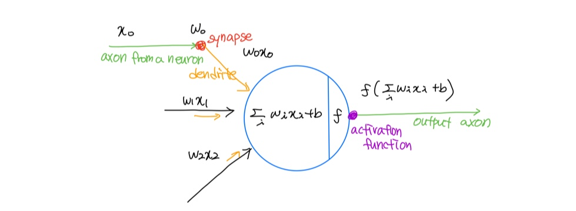
#### A neuron can be a binary logistic regressioin unit
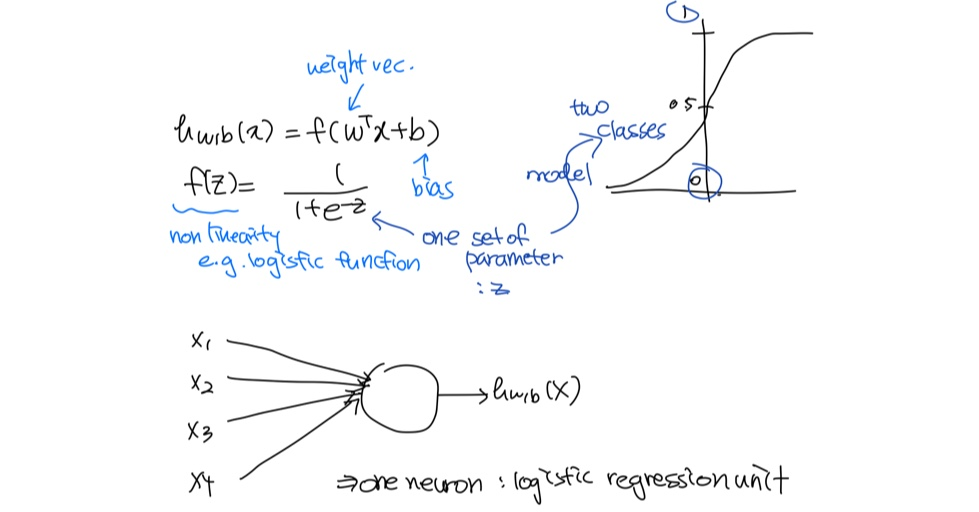
#### A neural network = running several logistic regression at the same time
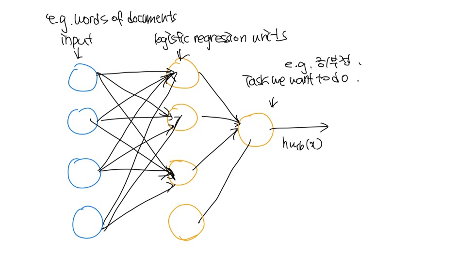
- 마지막 레이어의 classifier은 여전히 softmax와 같은 선형이지만, 중간의 레이어들이 공간을 re-represent하거나 여러가지로 비선형적으로 shift하게 된다.
#### Matrix notation for a layer
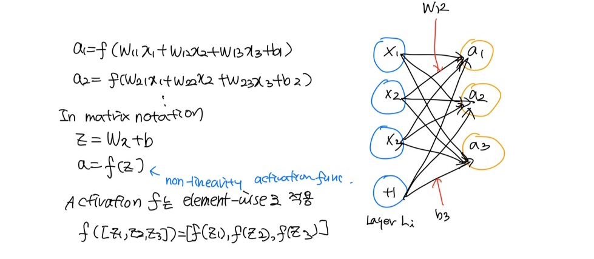
#### Non-linearities(aka "f"): Why they're needed
- 선형변환을 여러번 해도 결국 하나의 선형변환이기 대문에, 단순히 선형변환을 여러번 하는 것으로 classifier가 좋아지지 않는다.

---
3. Named Entity Recognition(NER)
---

NER의 태스크는 어떤 텍스트에서 names를 find하고 classify하는 것이다.

#### NER on word sequences
- 텍스트에서 단어들을 분류하고 word subsequences 로써 객체들을 추출한다.
#### Why might NER be hard?
- 어떤 객체의 boundary를 결정하기 어렵다. 가령, "First national bank donates 2 Vans~"라는 문장에서 첫번째 객체가 "First national bank"인지 "national bank"인지 파악하기 어렵다.
- 모호한 객체들이 있다.

---
4. Binary true vs corrupted word window classification
---
#### Binary word window classification
- 하나의 단어 안에서 모호함이 발생할 수 있다.   
가령, 한 단어가 전혀 반대의 뜻을 가질 수 있는데(auto-antonyms), "to sanction"는 "허가하다"의 뜻과 "처벌하다"의 뜻을 모두 가진다.
#### Window classification: softmax
- 하나의 큰 word window 벡터를 만들자!   
center word 주변의 단어 벡터들을 하나의 window로 concatenate한다.
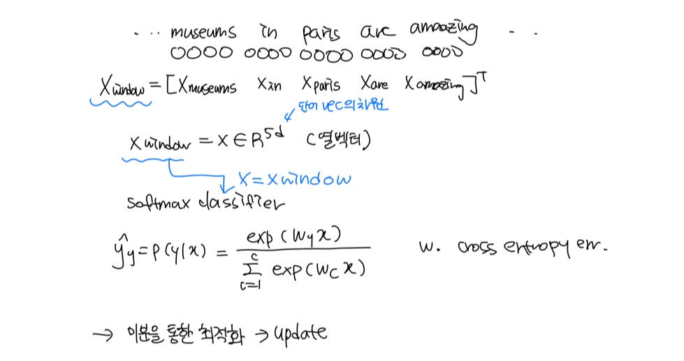
#### Binary classification with unnormalized scores
- 논문 Collobert & Weston (2008, 2011)에서 사용된 방법이다
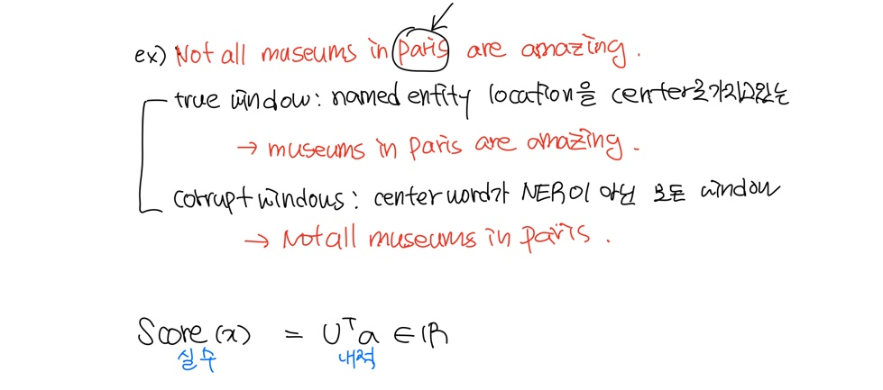
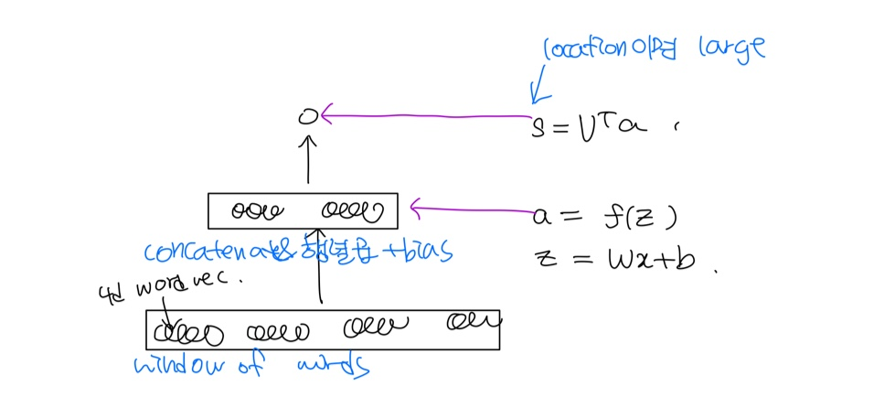
- 중간 레이어로 인해 단어 벡터 사이의 비선형 인터랙션이 가능해진다.
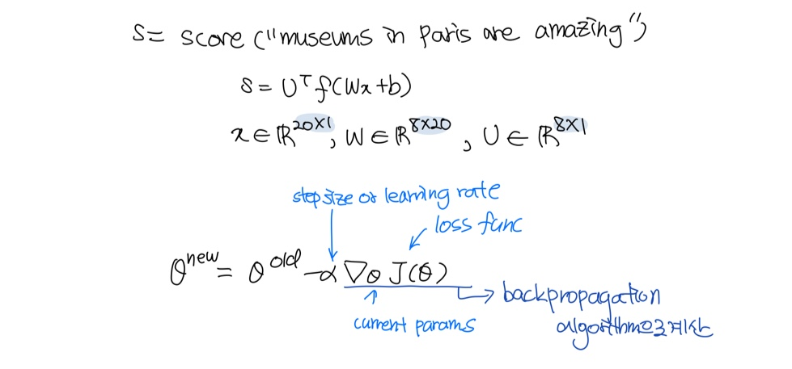
---
5. Matrix calculus introduction
---
- 직접 gradient를 계산해보자.
- 행렬 계산을 한다는 것은 fully vectorized gradients를 이용한다는 것이고, 이는 신경망 층을 계산하는 데에 더 빠르고 편리하다.
#### Gradients   
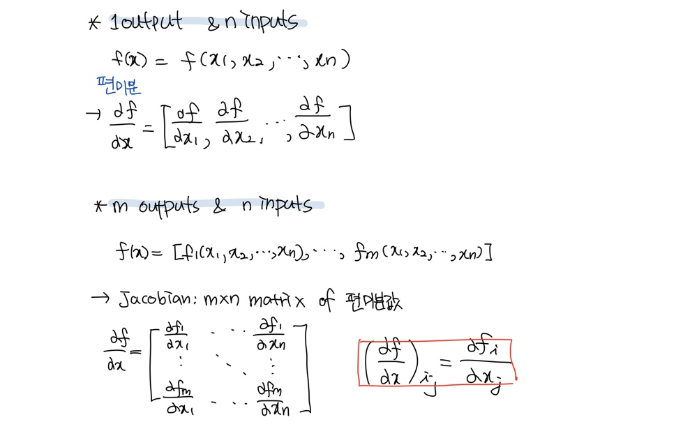
#### Chain rule   
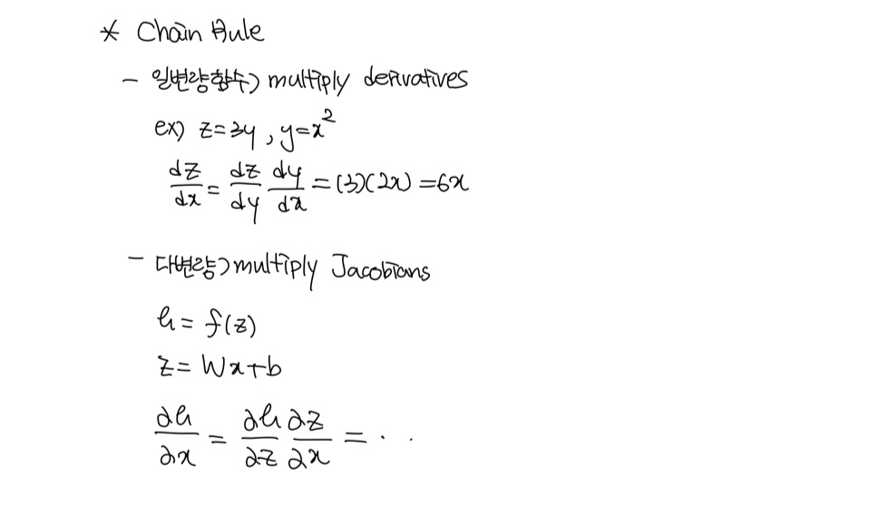
#### Our neural network
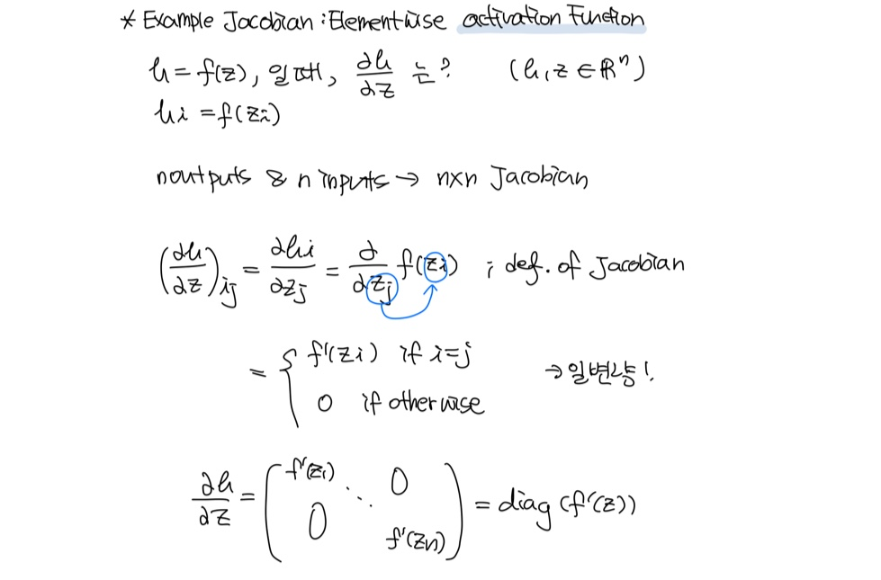
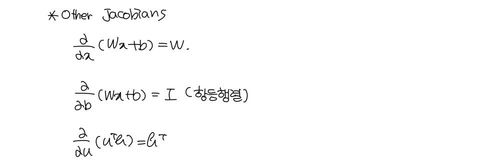
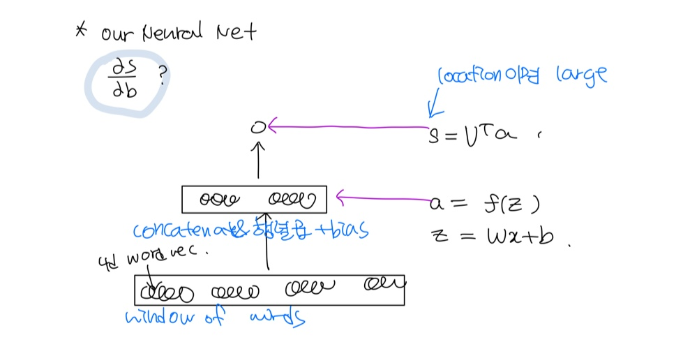
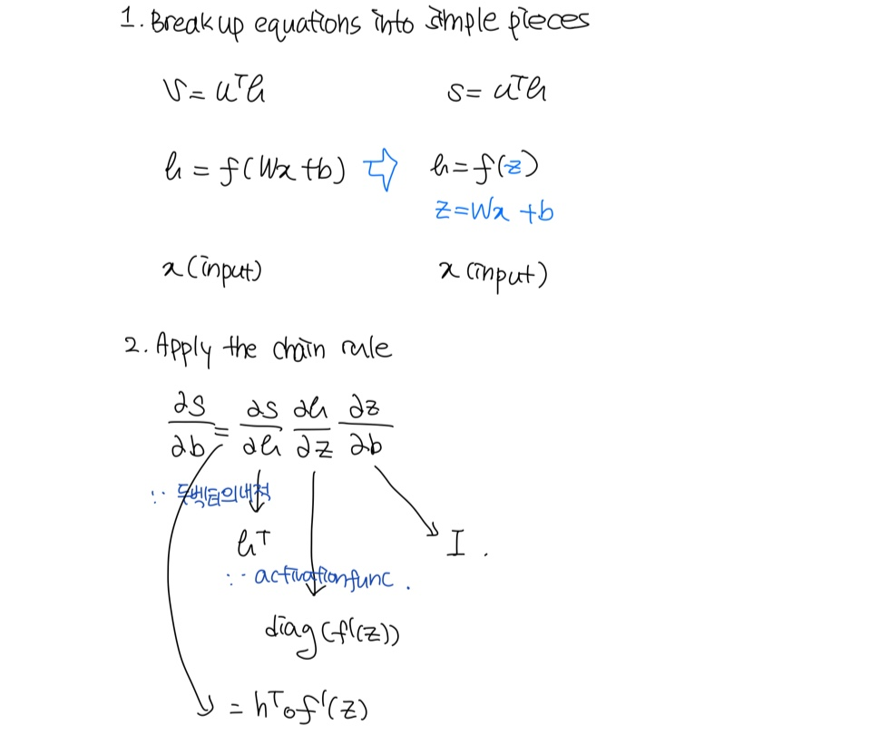
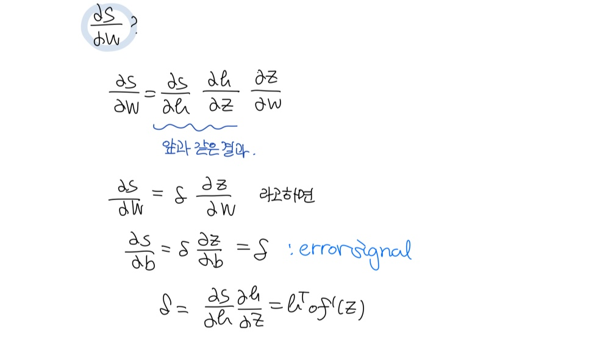
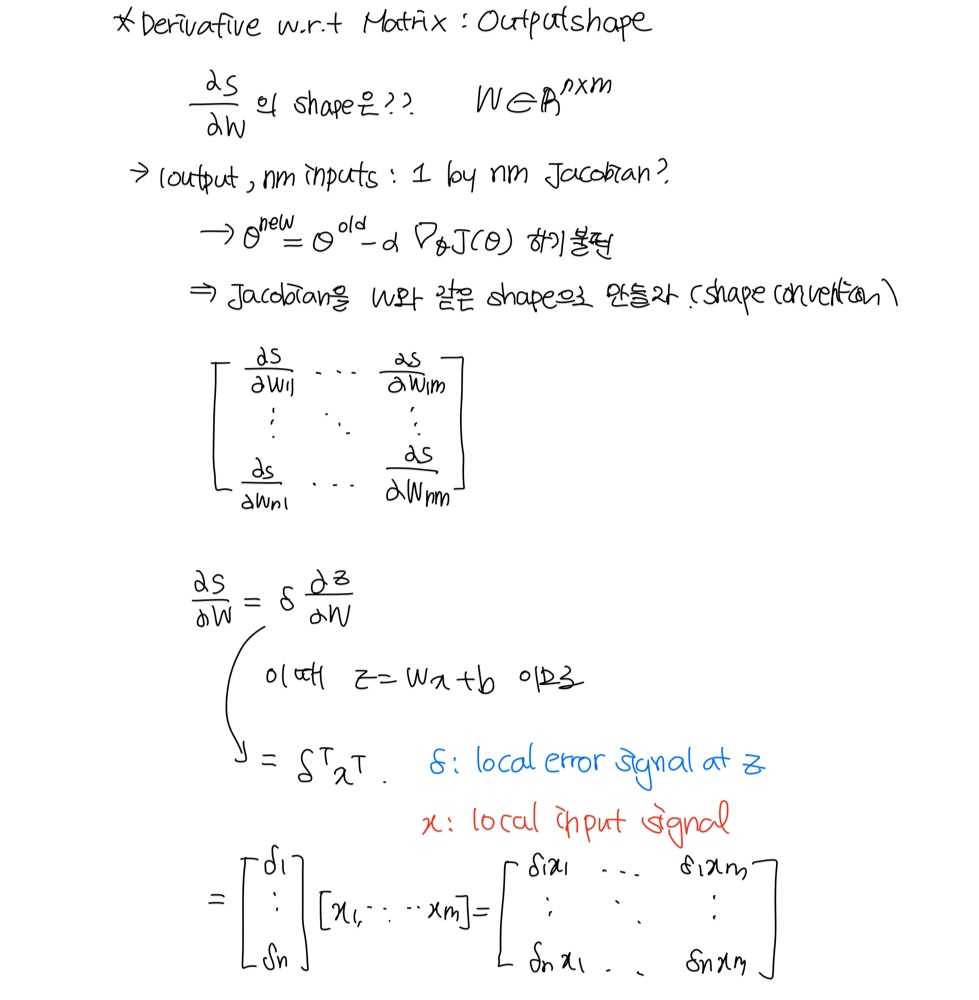