Lecture8: Translation, Seq2Seq, Attention
====
1. Pre-Neural Machine Translation
---
Machine Translation   
: source language -> target language

<1950년대>   
 이때부터 연구되기 시작했고, **Rule-based** 의 특징을 가진다. 언어를 bilingual한 dictionary로 매핑하는 형태였다.   

<1990년대~2010년대: SMT >   
**확률적**인 모델을 학습시키기 시작했다.   
1️⃣ 가장 좋은 번역문 y를 찾기 위해 다음과 같은 식을 푼다.

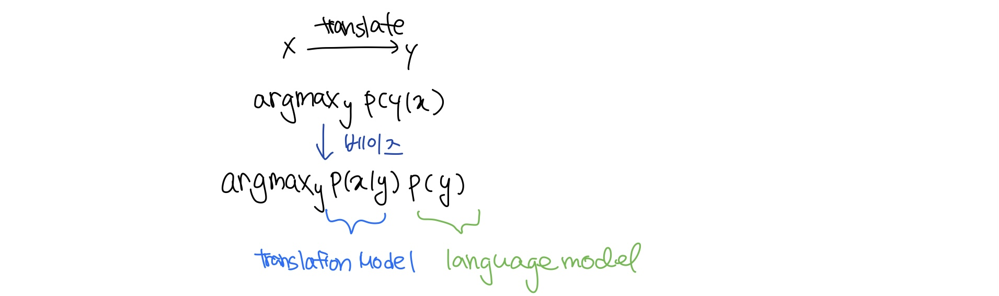

이 때, translation model은 어떤 단어와 구절로 번역되어야 할 지에 대한 것이다(fidelity). parellel data로부터 학습된다.   
language model은 전체적으로 그 문장을 짜임새 있게 쓰는 것과 관련이 있다(fluency). monolingual data로부터 학습된다.

2️⃣ p(x|y)를 학습하기 위해서는 
1. parallel data를 준비한다.
2. p(x|y)를 한 번 더 쪼개 **p(x, a|y)** 로 만들고 a라는 변수를 도입한다.

a는 alignment로 문장 pair에서 단어간의 대응관계를 말한다.   
문제는, 어떤 단어들은 다른 언어에 그 대응하는 단어가 없기도 하고, 여러개의 단어가 한개의 단어로 대응될 수도 있고, 한개의 단어가 여러개의 단어로 대응될 수도 있으며,여러개의 단어가 구 단위로 다른 여러개의 단어에 대응될 수도 있다는 것이다. 

아무튼 이러한 복잡한 aligning은 그 단어의 대응하는 위치까지 고려하여 p(x, a|y)를 학습하는 데에 사용되고, 또 어떤 단어가 특정한 fertility(대응하는 단어의 개수)를 가지는 확률 또한 학습에 사용된다.

3️⃣ argmax를 계산하기 위해서는   
물론 모든 가능한 y를 enumerate할 수 있지만 비용이 크다.   
따라서 heuristic알고리즘을 사용하여 search for best하면서 낮은 확률은 버린다.

✅ SMT는 굉장히 연구가 많이 이루어졌던 분야이고, 복잡한 시스템을 가지고 있는 시스템도 많았다.    
또한 위에서처럼 subcomponents로 나누는 작업을 더 많이 하는 시스템들도 있었는데, 이런 경우에는 어떤 특정한 언어적인 현상을 캡쳐하기 위해 피쳐 엔지니어링이 많이 필요했고, resource와 노동력도 많이 필요했다. 

---
2. Neural Machine Translation
---
NMT는 단 한개의 end-to-end 신경망으로 machine translation을 하는 방법이다.

NMT에서의 신경망 구조는 **sequence-to-sequence(aka seq2seq)** 라고 불리고, 두개의 RNN이 각각의 문장(source-target)을 핸들하는 구조이다.

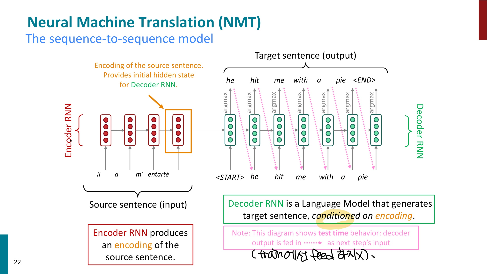
위는 seq2seq모델의 형태로 표현한 NMT태스크인데,   
encoder RNN이 source sentence를 인코딩해서 Decoder RNN에게 넘겨주고 Decoder RNN은 neural represantation으로 표현된 텍스트를 feed forward하면서 텍스트를 generate한다.    
(*이 그림은 test에서 모델의 작용을 보며주고, train할 땐 분홍색 화살표와 같은 feed과정이 없다.)

✅ MT말고 NLP의 다른 다양한 태스크에서도 seq2seq이 사용된다. 
- summarization(long text -> short text)
- dialogue(previous utterance -> next utterance)
- parsing(input text -> output parse as sequence)
- Code generation(natural language -> python code)

1️⃣ NMT를 학습하려면 seq2seq이 conditional language model이라는 것을 체크해야 한다.
디코더가 y의 다음 단어를 예측하는 형태의 language model이고, source sentence인 x애 대한 조건부 예측이라는 점에서 conditional하다.
따라서 NMT는 다음과 같은 식을 푼다.
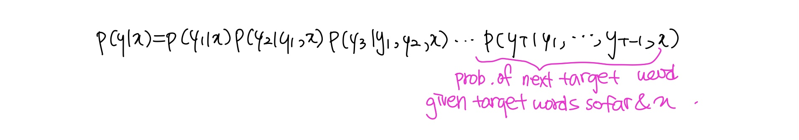

2️⃣ SMT와 다르게 NMT는 이 식을 한번에 train할 수 있다.

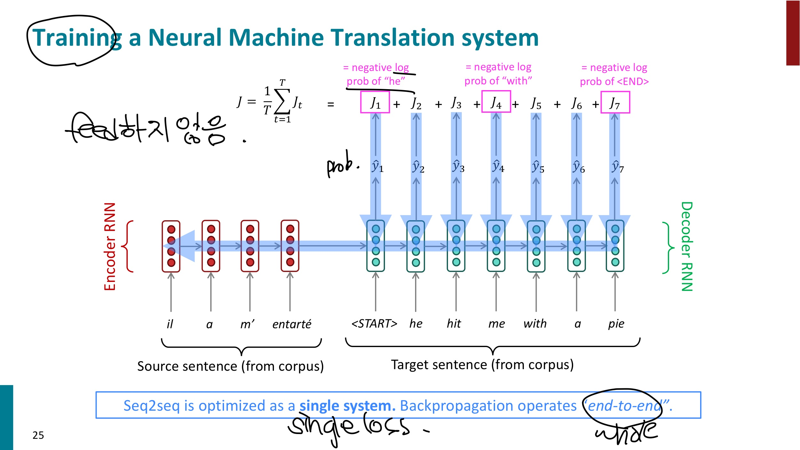

3️⃣ test모델에서 위에서 본 decoder의 알고리즘은 각각의 스텝에서 argmax를 취하는 형태였다. 이는 greedy decoding이라고 하는데, 문제는 각 결정을 undo할 수 없다는 것이다(go back할 수 있는 길이 없다)   
따라서 다음의 디코딩 알고리즘을 고려해 볼 수 있다.    
- Exhaustive search decoding
- Beam search decoding   

먼저 exhaustive search decoding은, V가 보캡 사이즈라고 할 때, 디코더의 각각의 단계t마다 가능한, 즉 V^t개의 partial translation을 추적하는것이다.
따라서 시간 복잡도는 O(V^T)로 매우 expensive 할 것이다.

Beam search decoding은 각 디코더 스텝에서 k개의 가장 확률이 높은 partial translation을 가설로써 검증하는 방법이다.
전체를 다 검증하지 않기 때문에 최적의 답을 낸다는 보장을 할 수 없지만, 위 방법보다 훨씬 효율적이다.
각각의 가설들은 다음과 같은 로그 확률로 표현되는 스코어를 가진다.

이러한 스코어를 가지고 빔 서치가 진행되는 과정은 다음과 같다.

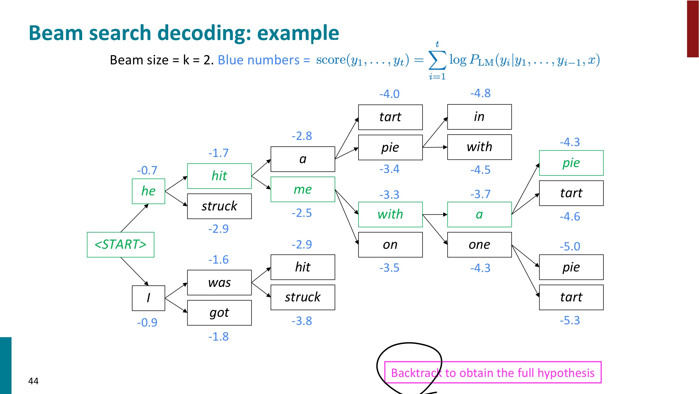

다음 단어에 대한 가장 가능한 k개의 가설에 대한 스코어를 계산하면서 쭉 진행해 나가고, 마지막에 탑 스코어를 기록한 브랜치를 백트래킹하면서 문장을 얻어낸다.

이 때, 그리디와는 모델이 멈추는 기준이 다르다.   
그리디는 end token이 나오면 바로 멈추지만, 빔 서치는 end token이 중간에 나와도 일단 제쳐두고 더 가능한 다른 가설들을 계속 찾아나가게 된다.
따라서 빔 서치에서는 특정한 timestamp를 지정해주거나 적어도 n개의 가설을 검증하도록 하는 식으로 끝나는 기준을 지정해주면 된다.

💡 문제점은,   
문장이 길어질수록 확률이 계속 곱해지니 더 낮은 스코어가 나올 수 있다는 것인데, length로 노말라이즈 해서 탑 스코어를 선택해주어서 해결해주도록 한다.

💡 SMT와 비교하면,   
더 유연하고 맥락과 구절의 유사성을 잘 사용해서 더 좋은 성능을 끌어낼 수 있고, subcomponents로 분리하는 방법을 사용하지 않고 하나의 신경망을 사용하기 때문에 더 편리하다.    
또 언어적 현상을 따로 캡쳐하는 것이 아니라 피쳐 엔지니어링이 불필요하고 모든 언어에 같은 방법을 적용시킬 수 있다는 장점이 있다.

하지만 less interpretable해서 디버깅하기 어렵고, 번역의 룰을 정확히 특정하기 어렵기 때문에 나쁜 단어를 뱉을 수 있는 등 통제하기가 어렵다.

✅ 계속해서 발전시키기 위해 번역 성능을 평가하는 지표로 **BLEU(Bilingual Evaluation Understudy)** 를 사용한다.   
기계번역된 문장과 사람이 쓴 문장들을 비교해서 similarity score을 다음에 기초해서 계산한다.
- n-gram precision
- penalty for too-short system translations

이러한 BLEU를 사용해서 평가한 그래프를 보면

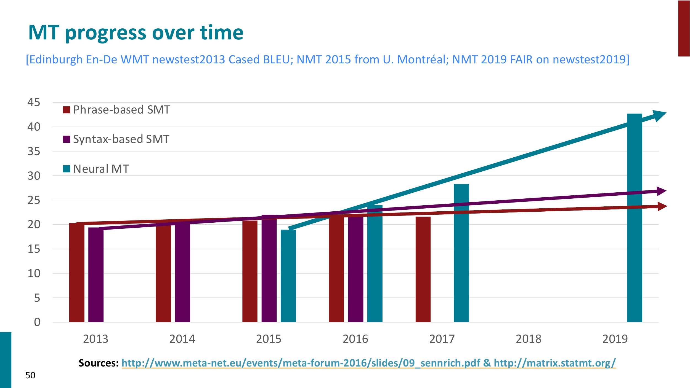

NMT의 성능을 파악할 수 있다.

NMT에서도 여전히 해결되지 않는 문제들이 있는데,
- 단어사전을 벗어난 단어들
- 학습데이터와 테스트데이터 사이의 도메인 불일치
- 더 긴 맥락(을 더 효율적으로 계산)
- 정보가 적은 언어들
- bias 문제
등등이 있다.

일련의 연구 도중 NMT를 굉장히 발전시킨 어떤 technique이 등장하게 되는데 바로 Attention이다.

---
3. Attention
---
기존의 seq2seq 모델은 마지막 하나의 neural representaion으로 문장 전체의 정보가 담겨야 하기 때문에 다음 그림과 같이 병목 현상이 발생한다.

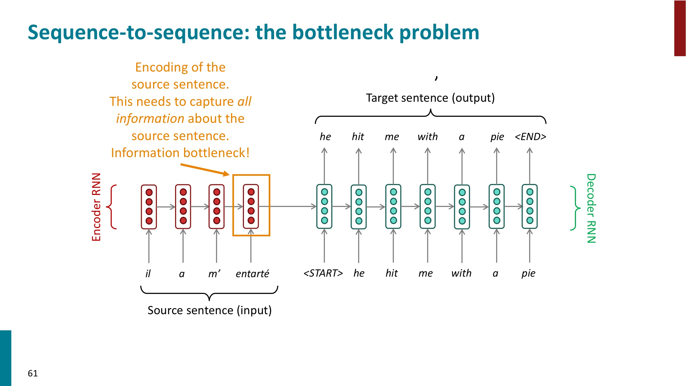

따라서 Attention은 디코더의 각 단계에서 인코더와 직접 연결해서 source sentence의 특정한 부분이 주목될 수 있도록 한다.

1️⃣ 그림으로 표현하면 다음과 같다.

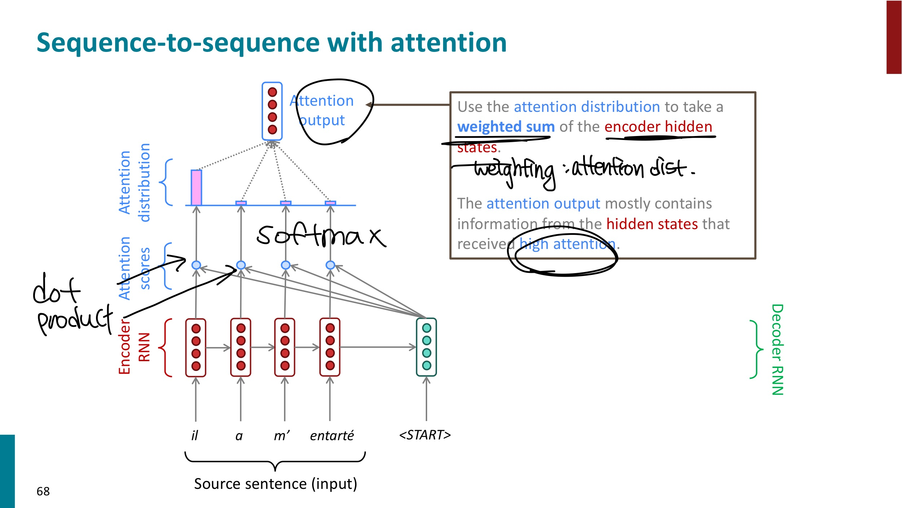

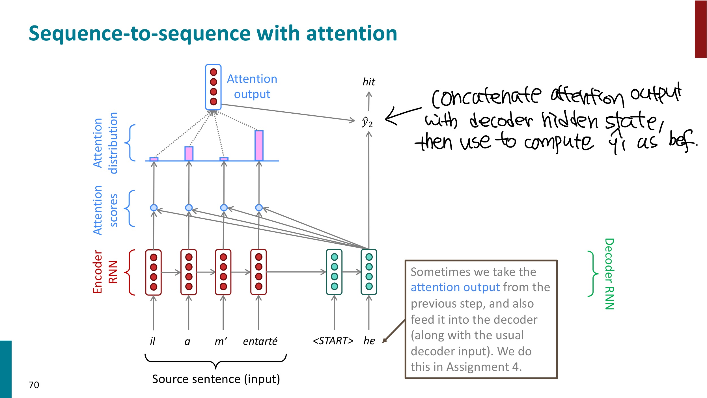

2️⃣ 수식으로 표현하면 다음과 같다.

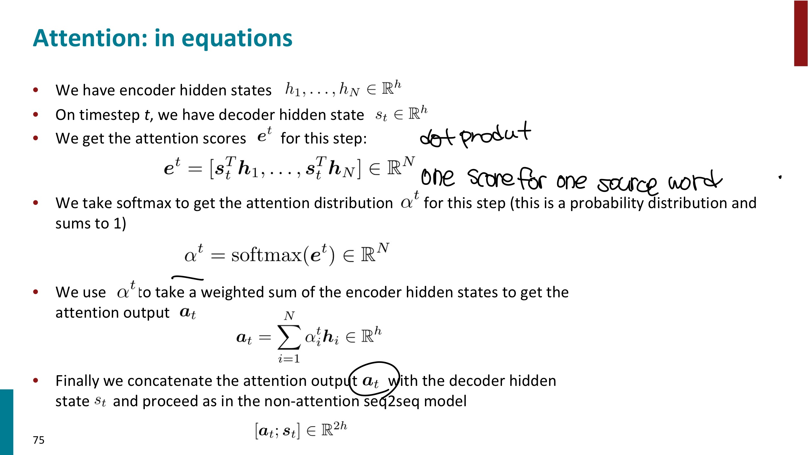

이러한 Attention은 굉장히 좋은 성능 향상을 보여주었다.
- 디코더가 source를 직접 볼 수 있게 해서 병목 현상을 해결했다
- vanishing gradient 문제를 해결하는 데에 도움이 된다. (먼 state에 대한 shortcut을 제공하기 때문에)
- 모델이 비지도학습처럼 스스로 alignment를 배우게 된다!

✅ 어텐션 스코어를 계산하는 방식은 여러가지가 있다.
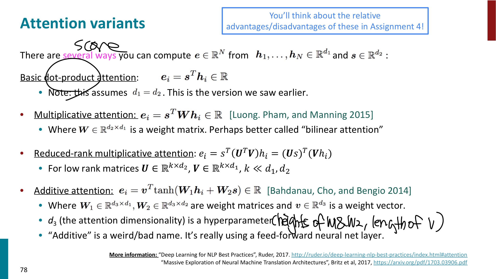
- basic dot product attention은 dot product의 차원이 클 때 학습이 잘 되지 않는다는 단점이 있다.   
query와 key의 차원이 같아야 한다.   
- multiplicativ attention 은 행렬곱을 통해 효율적인 계산을 가능케 한다.
- additive attention 은 큰 차원에서도 성능이 유지되고, 어텐션의 query와 key의 차원이 동일하지 않아도 된다.
- 연산량의 부담이 적으면서 dimension이 큰 경우에도 성능이 괜찮은, 다음과 같ㅇ든 scaled dot-product 기반의 attention 이 최근 자주 쓰인다고 한다.
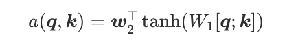

✅  attention에 대한 더 일반적인 정의    
attention은 vector values와 vector query가 주어졌을 때, query에 dependent하게 values의 weighted sum 을 계산하는 테크닉이다!
- weighted sum 은 values가 담긴 정보에 대한 선택적인 summary이다.
- query는 많은 values들 중에 어떤 values에 얼마나 더 focus할 지 결정한다.
- 'query attends to the values'   

이러한 attention은 seq2seq말고 다른 아키텍쳐에서도, MT말고 다른 태스크에서도 사용할 수 있다.