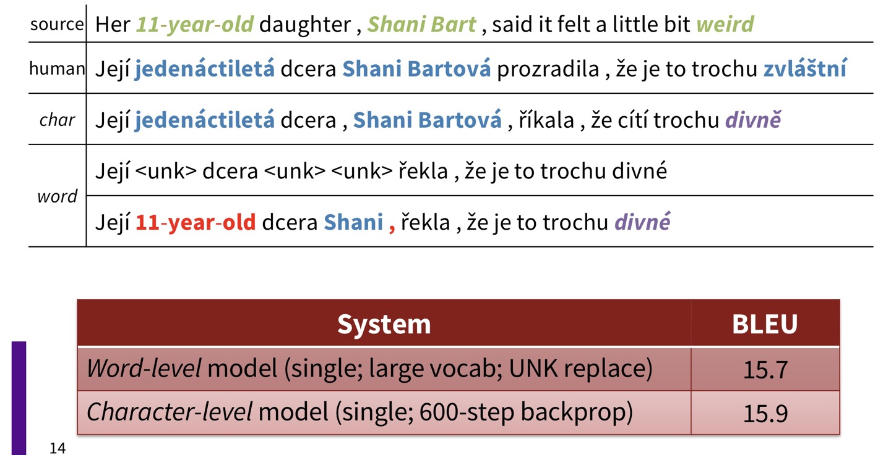
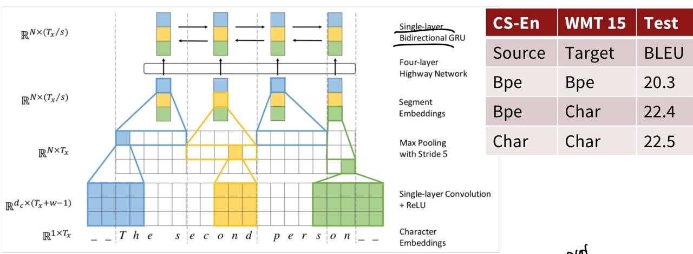
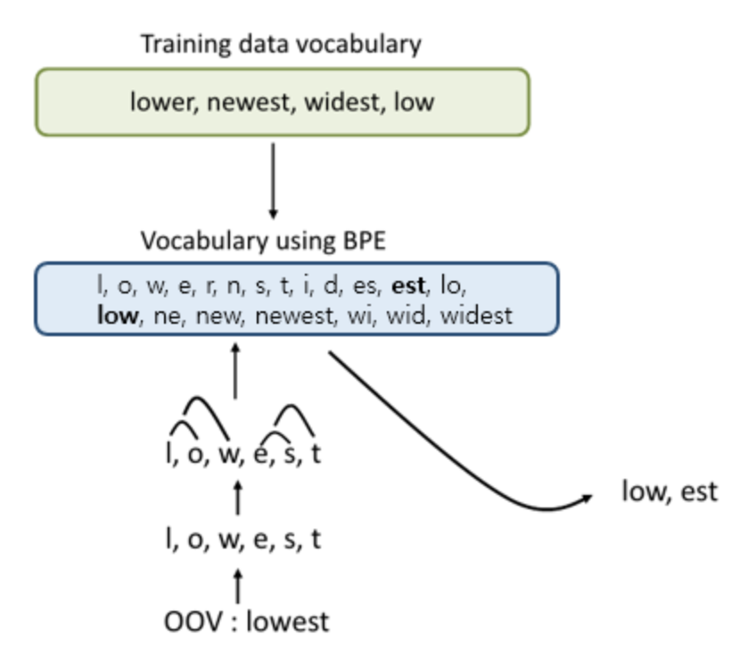
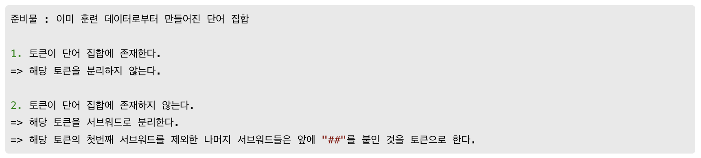
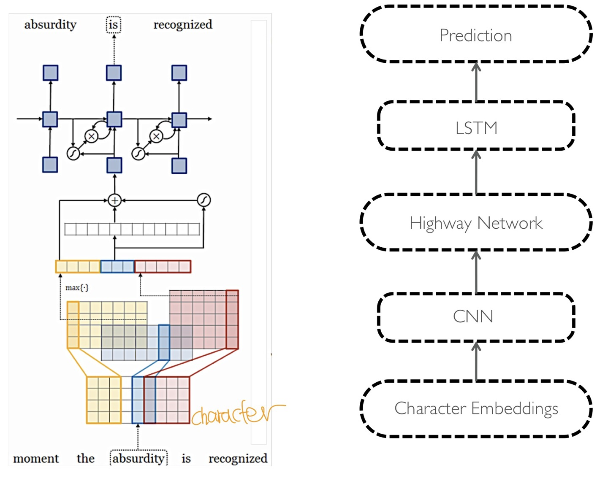
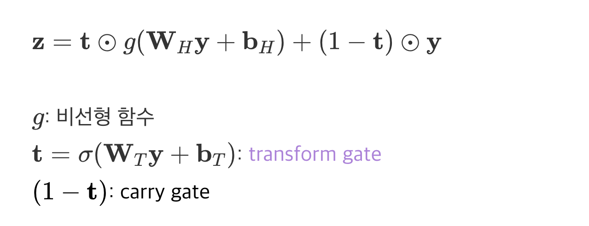
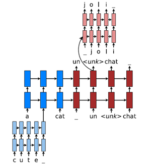

Lecture 12: Information from parts of words: Subword Models
====
1. linguistics
---

음운론(Phonology)이 제시하는 것 중 흥미로운 사실은,   
인간이 categorigcal perception 을 가지고 있다는 것이다.
입으로 낼 수 있는 소리는 연속적인 space이고 무한하지만,   
인간은 그것을 phoneme(음소)나 어떤 뚜렷한 feature와 같은 categoricl unit으로 인지한다.

보통 그러한 의미를 가지는 unit 중 가장 작은 단위를 형태소(morpheme)라고 하는데,   
딥러닝에서는 Morphology에 관한 연구는 거의 이루어지지 않았다.    
학습되면서 단어벡터들이 조정되며 알아서 어느정도 catch되는 면이 있고,   
그 정도면 충분하다고 생각되었기 때문이다.

그런데 이 형태소들을 고려하면 이점이 많다.
언어들 중에는 중국어와 같이 글자간의 띄어쓰기가 없는 언어도 있고,    
아랍어와 같이 접어(Clitics)를 여러 개 붙여쓰는 언어, 프랑스어처럼 띄어 쓰는 언어, 독일어같이 복합어를 붙여쓰는 언어와 그렇지 않은 언어 등 다양한 언어가 있기 때문이다.

따라서 제시된 것이 character-level model이다.   
character-level model의 기본적인 컨셉은 다음과 같다.

- word embedding 이 character embedding으로부터 합성될 수 있다.
- 이를 통해 모르는 단어에 대해서 embedding을 만들 수 있다.
- 비슷한 spelling은 비슷한 embedding을 공유한다.
- OOV problem (Out-of-Vocabulary 문제)를 해소할 수 있다.

---

2. Purely character-level models

---

`` Very Deep Convolutional Networks for Text Classification (11강)``

- deep convolutional stack을 통해 character level 학습

``English-Czech WMT 2015``

- pure character-level seq2seq (LSTM) NMT system
- word-level 만큼 성능이 좋았지만, 학습시간이 오래걸린다.   
character 자체에 의미가 별로 없어서 캡쳐하기 위해 backpropagation 등 작업이 많이 수행되기 때문이다.
- word level에서는 vocabulary에 없어 unknown으로 나타나는 단어를 표현할 수 있다.

``Fully Character-Level Neural Machine Translation without Expicit Segmentation (2017)``

- Encoder은 다음과 같고, decoder은 char-level GRU 이다.

---

3. Subword-models: Byte Pair Encoding and friends

---

subword 모델의 architecture에는 두 가지 트렌드가 있다.

1️⃣ word-level모델과 같은 architecture:
더 작은 단위인 **word pieces**를 사용

2️⃣ hybrid archutecture:
main model은 word단위를 쓰고, character모델은 **byte pair encoding** 사용

``byte pair encoding    : Neural Machine Translation of Rare Words with Subword Units (2016)``

원 논문 코드: https://github.com/rsennrich/subword-nmt

- 딥러닝이 아닌, 데이터 압축(compression) 알고리즘에서 비롯된 word segmentation 알고리즘
- character로 분리된 unigram vocabulary 에서 시작해서,
  가장 빈번한 ngram pair들을 새로은 ngram으로 vocab에 반영

``wordpiece(a.k.a Sentencepiece) model``

- google NMT(GNMT) 가 사용
- character로부터 subword을 병합하는 방식은 byte pair encoding과 유사하나,    
greedy approximation 을 사용해서 subword piecies 를 선택할 확률을 최대화
- 띄어쓰기는 '_'라는 토큰으로 저장됨
- Bert 또한 subword toknizer로 Wordpiece를 사용
- 자주 등장하는 단어는 그대로 단어 집합에 추가하지만,   
 자주 등장하지 않는 단어의 경우에는 더 작은 subword로 분리되어 단어 집합에 추가
  (출처: https://wikidocs.net/115055)
  ex) hyptia = h ##yp ##ati ##a

---

4. Hybrid character and word level models

---

``Character-Aware Neural Language Models``

- character 단위의 1-layer CNN과 max-over-time pooling을 거쳐 문장의 구조를 학습하고, 그 출력값을 입력값으로 갖는다.
- highway network
    
(출처:https://everyday-log.tistory.com/entry/%EB%85%BC%EB%AC%B8-%EB%A6%AC%EB%94%A9-Character-Aware-Neural-Language-Models)   
LSTM의 메모리 셀처럼 기능한다. 입력값(original information)의 일부를 출력값으로 직접 carry함으로써 딥 네트워크를 adaptivelt하게 학습한다.

``Hybrid NMT``

- A best-of-both-worlds architecture :대부분의 번역을 word level에서 수행하나, 필요할 떄에만 character level 로 감
- seq2seq with attention, 8-stacking LSTM NMT system

- unknown 에 대해서 char-level beam search

---

5. fastText

---

``Enriching Word Vectors with Subword Information (2016)``

- charcter n-gram 을 이용한 word2vec skip-gram model의 확장
- 각 단어를 char단위 n-gram 을 사용하는데, 양끝에 <>를 포함하고 기존 단어에도 <>를 붙여서 토큰을 만든다.ex) n=3인 경우,<wh, whe, her, ere, re>, < where>
- 단어 하나의 벡터값을 이러한 벡터값들의 합으로 표현한다.
