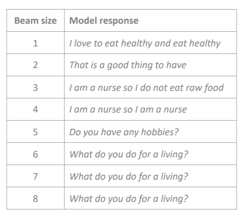
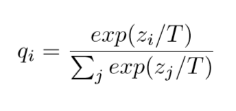
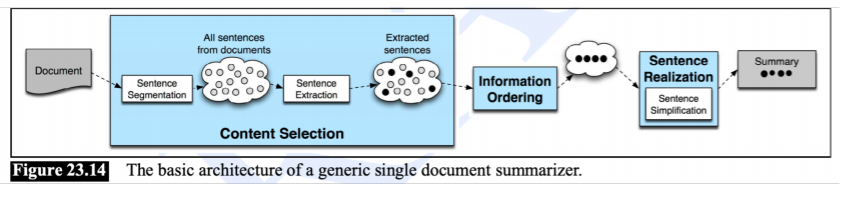
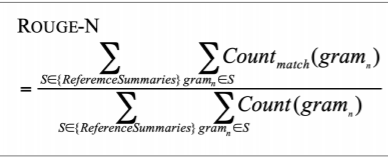
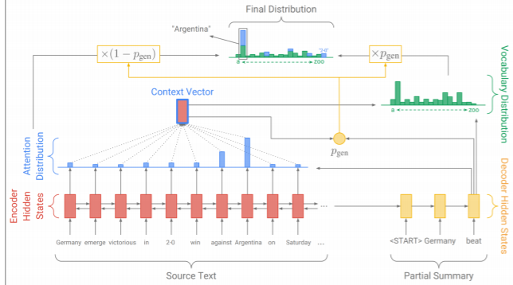
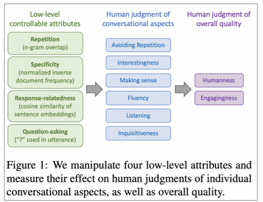

# Ch15 : Natural Language Generation

# 1. Recap: LMs and decoding algorithms

Greedy decoding

- 각각의 step 에서 most probable 한 단어를 선택하는 것 (argmax)
- <END>를 produce할 때까지 계속 이전 스텝의 단어를 다음 step에 feed하는 과정 반복
- backtracking하기 힘들기 때문에 아웃풋이 안좋을 수 있음 (문법이 안 맞거나 , 자연스럽지 않거나)

Beam search decoding

- search 알고리즘이며, 한번에 여러가지 가능한 sequences들을 track함으로써 high-probablity sequence를 찾는 것을 목적으로 함. 꼭 optimal sequence를 찾는 것은 아님.
- 디코더의 각각의 스텝에서 k-most probable partial sequence(hypothesis) 를 찾음
- 이 때, k 가 beam size

k값에 따른 영향

- k가 작으면 greedy와 비슷한 문제가 있음 (k=1이면 greedy와 같게 됨)
- 크면 expensive 하기도 하지만, NMT에서는 BLEU score가 낮아지는 결과가 나타남 
- 더 짧은 문장이 선택될 가능성이 높기 때문 (score normalization을 해도!)
- open-ended태스크에서는 커질수록 더 generic한 결과를 내게 됨 (그림 참조)

Sampling-based decoding

1. Pure sampling
- step t 마다 확률분포  Pt에서 무작위 추출
- greedy와 비슷하지만 argmax대신 sample을 하는 것
1. Top-n sampling (원래 이름은 Top-k sampling이나 파라미터 이름 혼란 방지로 여기서만 n)
- step t 마다 확률분포 Pt에서 top-n most probable words로 제한해서 추출 (확률분포를 잘라서 추출하는)
- n=1이면 greedy search, n=V이면 pure sampling과 같다.
- n을 늘리면 다양하고 risky한 아웃풋이 나오고, 줄이면 generic하고 safe한 아웃풋이 나온다.

Softmax temperature

- LM의 vector score에 소프트맥스 함수를 적용한 기본적인 확률분포에서 temparature hyperparameter을 소프트맥스 함수에 적용한다.

- 파라미터가 클수록 더 uniform 해진다.
- 디코딩 알고리즘은 아니고, test time에서 디코딩 알고리즘과 결합해서 쓸 수 있는 테크닉이다.

> ***summary***
greedy decoding 은 간단하지만 아웃풋 퀄리티가 낮다.
Beam Serach는 greedy 보다 퀄리티가 좋지만 k가 너무 크면 일반적이고 짧은 결과가 나올 수 있다.
Sampling methods는 다양성과 랜덤함을 부여할 수 있기 때문에, open-ended태스크에 좋다. 
Softmax temperature은 디코딩 알고리즘과 결합하여 다양성을 컨트롤 할 수 있는 테크닉이다.
> 

# 2. NLG tasks and neural approaches to them

Summarization: task definition

Task: 인풋 텍스트 x가 주어졌을 때,  x에 대한 주요 정보를 담고 있는 더 짧은 요약 텍스트y를 생성하는 것

- Single-document: 한개의 문서 x에 대해 요약문을 작성하는 것
- Multi-document: 여러 개의 문서 X1, ..., Xn에 대해 요약문을 작성하는 것

Source documents

- Gigaword: 기사의 헤드라인(sentence compression)
- LCSTS(Chinese microblogging): paragraph를 문단으로 요약
- NYT, CNN/DailyMail: 뉴스 아티클을 한개/여러개의 문장으로 요약
- Wikihow: full how-to article의 heading 사용, 뉴스 베이스가 아니라는 점에서 이전 것들과 차별점

> Setence simplification 은 서머리와 조금 다른 태스크이다.
source text를 더 간단하거나 짧게 rewrite하는 것인데, 이 때에는 다음과 같은  데이터를 사용한다.
- Simple Wikipedia: 일반 위키피디아의 짧은 버전
- Newsela: 뉴스 기사를 아이들을 위해 작성한 버전
> 

Summarization: two main strategies

1. Extractive summarization
: 기존 문장에서 몇 부분들은 셀렉트 하는 방식이다.
2. Abstractive summarization 
: NLG를 사용해서 새로운 텍스트를 만든다.

Pre-neural Summarization

- 대부분 extractive 이다.
- 일반적인 Pipeline은 그림과 같은데,
1. Content selection: 포함할 주요 문장을 선택한다. 
    이 때 사용하는 알고리즘으로는 크게 두 가지가 있다.
    - Sentence scoring functions
    : 키워드의 존재 유무를 tf-idf와 같은 방식으로 계산하거나,
    - Graph-based algorithms
    : 문서를 일종의 문장들의 집합으로 봄. 문장들은 노드를 이루고, 문장 간의 유사도가 Edge weight에 비례한다. 이를 이용하여 중심 문장을 선택한다.
    1. Information Ordering : 선택된 문장들이 어떠한 순서로 놓여야 하는지 결정한다.
    2. Sentence Realization : 문장들이 자연스럽게 이어지도록 단순화, 일부 제거, 접속사 추가 등의 작업을 한다.

Summarization: ROUGE

BLUE와 유사한 n-gram overlap에 기반하고 있다.

다른 점은 다음과 같다.

- Brevity penalty가 없다 : 문장이 짧아서 문제가 되지 않음
- Recall에 기반하고 있다 : precision 보다 recall 이 중요하다! BLUE는 precision에 기반한다.
    
    recall/precision
    

또한 BLEU가 4개의 n-gram을 종합하여 하나의 점수로 나온 것과 달리 ROUGE는 각각의 n-gram 마다 다른 점수가 나온다. 즉, 다음과 같은 분류가 가능하다.

- ROUGE-1 : unigram을 활용한 것과 같다.
- ROUGE-2 : bigram을 활용한 것과 같다.
- ROUGE-L : n-gram에서 n을 고정하지 않고, 단어의 등장 순서가 동일한 빈도수를 모두 세는 방식이

Neural summarization (2015-present)

- 2015: seq2seq+attention

Neural summarization: copy mechanisms

- seq2seq+attention은 fluent했지만 rare word와 같은 디테일들을 정확하게 copy하는 것을 잘 못했음
- copy mechanism은 seq2seq이 인풋에서 단어와 구들을 적절하게 카피해서 아웃풋으로 가져갈 수 있게 함 (즉 summarization에서 매우 좋음)
- copy와 generation 을 모두 가능케 함으로써 앞서 나온 두 가지 방법인 extractive approach, abstractive approach를 하이브리드하게 사용하는 것
    
    
    

위는 일반적인 카피 메커니즘 모델이다.

- P_gen은 단어를 copy할지 생성할지 결정지어주는 generation probability이다. 
어텐션 분포를 이용하여 context vector를 만들고, 이를 디코더의 hidden state와 같이 처리하여 P_gen을 만든다. 
P_gen은 디코더의 이번 시점에서 문장을 어느정도 비율로 생성할지 결정하게 된다. 
그리고 디코더를 통해 만들어진 토큰의 분포가 P_gen과 곱해지고, 인코더의 어텐션 분포와 (1-P_gen)이 곱해지게 되어 일종의 가중합된 두 분포를 더해서 최종적인 이번 시점의 토큰 분포를 만들게 된다.
여기서 최종적인 토큰을 뽑는다. 이렇게 하면 토큰을 그대로 copy할지, 생성해야 할지 좀 더 유연하게 결정할 있다고 한다.

이 copy mechanism의 문제점은 다음과 같다.

- copy를 너무 많이 한다.
- 인풋 텍스트가 길면 overall하게 컨텐츠를 뽑아내지 못한다.

Bottom-up summarization

- 이를 개선하기 위해 두 가지로 단계를 나눈 방법이 등장했다.

1. content selection stage: 단어를 포함할 지 안할지에 대해 neural sequence-tagging model을 사용해서 단어를 태그한다.
2. Bottom-up attention stage: 태그되지 않은 단어는 atteition 이 attend할 수 없다.(마스킹 하는 것과 비슷)
- 이 모델은 긴 문장들을 카피하는 걸 방지할 수 있기 때문에 좀 더 abstractive한 아웃풋을 내는 게 가능하다.

Dialogue

기존  seq2seq모델을 사용했을 때 문제점은, 너무 generic한 문장을 이야기하거나, 관계없는 주제에 대해서 이야기 하는 경우가 많았다는 것이다.

해결책으로 다음과 같은 방법들이 제시되었다.

- MMI(Maximum Mutual Information

response T에 대한 input S의 매핑을 최적화하는 대신, 조건부확률의 분모에 조건을 추가해서 상호 정보량을 최대화한다. 
S라는 사용자의 말에 대해 T라는 문장을 만들어야 하는데, 그 문장이 너무 일반적이면 패널티를 부과하는 것이다.
일반적인 문장일수록 *p*(*T*)가 커질 것이기 때문이다.

- rare word를 직접 upweight한다
- beam search 가 아닌 sampling decoding algorithm을 사용한다.

Storytelling

Poetry generation

Non-autogressive generation for NMT

# 3. NLG evalutation

Automatic evaluation mericst for NLG

BLEU, ROUGE, METEOR, F1 과 같은 Word overlap based metrics 는 summarization, dialogue 등에 translation 보다도 더 적합하지 않다. 
그렇다고 해서 perplexity를 사용하는 것은, 생성된 문장이 좋은 문장인지 알 수 없다. 

따라서 문장의 어떤 특정 요소에 대한 더 focused 된 metrics들을 정의해서 사용할 수 있다. 

- Fluecy, Correct style, Diversity, Relevance to input...

Human evaluation 또한 gold standart로 간주되곤 하지만, 사실 생각해보면 객관적인 지표가 아니다.

사람마다 기대수준이나 배경이 다르기 때문이다.

따라서 이러한 기준을 가지고 진행한 결과,

- 반복을 제어하는 것이 매우 중요했다.
- 더 질문을 많이 하는 것이 engagingness에서 높게 평가되었다.
- humanness 를 극대화 하는 것은 모든 chatbot들이 잘 못했다.

# 4. Thoughts on NLG research, current trends, and the future

Existing current trends in NLG

- Left-to-right generation에서 벗어난 parallel generation, iterative refinement, top-down generation등을 시도
- maximum likelihood training를 대체하는 더 전체적인 sentence-level 목표를 가짐

Tips for NLG!

- perplexity개선과 같이 LM 모델을 개선하면 generation quality 가 높아질 수 있다.
- specific한 improvement를 목표로 해라!
- 여러개의 automatic metrics를 써라.